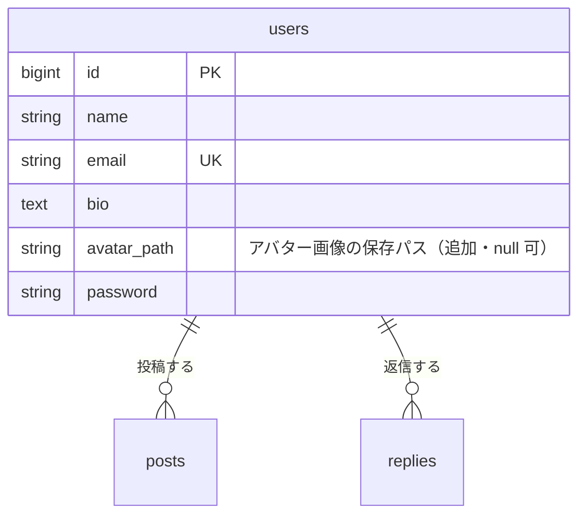

# アバター画像 設計書

Issue: [#3 プロフィールにアバター画像を設定できるようにする](https://github.com/TakanoriShima/post-app-practice/issues/3)

前提: [#2 プロフィール機能](profile.md)（プロフィール編集画面と、アイコンの部品 `<x-avatar>`）

## 概要

プロフィールの頭文字と色のアイコンに加えて、自分で選んだ任意の画像をアバターとしてアップロードできるようにする。設定した画像は、丸い画像として、ポストとリプライの投稿者に表示する。

- アップロードは、#2 で作ったプロフィール編集画面（`profile.edit`）に足す。
- アップロードされた画像は、サーバーで加工して保存する。向きを補正し、中央を正方形に切り抜き、256×256 に縮小し、WebP で保存する。
- 加工後の画像だけを保存するので、元の写真に入っていた EXIF（位置情報など）は残らない。
- アバターは `users` に紐づくので、変更すると、その人の過去のポストとリプライにも反映される。
- 未設定のユーザーは、今の頭文字と名前で決まる色のアイコンのまま。
- 編集できるのは本人だけ（#2 と同じく、ルートに `{user}` を持たせない）。

## 受け入れ条件

- [ ] 自分のプロフィール編集で、任意の画像をアバターとしてアップロードできる
- [ ] 設定したアバターが、丸い画像として、ポストとリプライの投稿者に表示される（タイムライン、ポスト詳細、プロフィール）
- [ ] アバターを設定していないユーザーは、今の頭文字と色のアイコンが表示される
- [ ] アバターを差し替えたり、削除して未設定に戻したりできる（古いファイルは消える）
- [ ] 画像以外、非対応の形式、大きすぎる画像はエラーが表示され、保存されない
- [ ] 他人のアバターは変更できない

## 変えないもの

- タイムライン、ポスト、リプライの今の動き。アバターを設定していないユーザーの見た目。
- #2 のプロフィールの表示と編集の動き。アバターの項目が増えるだけ。名前・メール・自己紹介の入力チェックとメッセージも変えない。
- 認可（`PostPolicy`、`ReplyPolicy`）。認証まわり。

対象外（今回は作らない）

- ブラウザ上で切り抜きの範囲を選ぶ操作（中央を自動で切り抜く）
- 動く GIF（最初の1コマだけを使う）
- HEIC、SVG
- seed でのアバター投入
- 画像の保存先を外部ストレージ（S3 など）にすること

## 増えるテーブル

新しいテーブルは増えない。`users` テーブルに列を1つ追加する。

| カラム | 型 | 制約 | 説明 |
| --- | --- | --- | --- |
| `avatar_path` | string | null 可、`bio` の後ろ | `public` ディスク内の保存パス（例 `avatars/xxxx.webp`）。null なら未設定 |

- 既存のユーザーの `avatar_path` は null になる。既存データは変わらない。
- 画像ファイルは `storage/app/public/avatars/` に置く（`.gitignore` 済みで、git には入らない）。
- ファイル名はランダムで、元のファイル名は使わない。差し替えるたびに名前が変わるので、ブラウザのキャッシュで古い画像が出続けない。
- `avatar_path` は `$fillable` に入れない。画面から送られた値で書き換えられないようにし、コントローラーだけが設定する。

## 増える画面

新しいルートは増えない。#2 の `profile.edit` と `profile.update` を拡張する。

### プロフィール編集（`profile.edit`）

- フォームの一番上に「アバター画像」を置く。現在のアバター（96px）、ファイル選択、ヒント（「JPEG・PNG・WebP・GIF、5MB以内。中央が正方形に切り抜かれます。」）を出す。
- ファイルを選ぶと、その場で丸くプレビューする（JavaScript）。保存は「更新」を押したとき。
- アバターを設定済みのときだけ「画像を削除して初期アイコンに戻す」のチェックを出す。
- フォームは `enctype="multipart/form-data"`。
- エラーがあるときは、アバターの下にエラーメッセージを赤字で表示する。ファイルは、ブラウザの仕様で選び直しになる。

### アイコンの部品（`<x-avatar>`）

- `$user->avatarUrl()` があれば、丸い画像（``）を出す。なければ、今の頭文字のアイコン（`
`）を出す。
- 画像は `object-fit: cover` で丸く切り抜く。`alt` にはユーザー名を入れる。44px のとき（タイムライン、ポスト詳細、一覧）は遅延読み込み（`loading="lazy"`）にする。
- `User::avatarUrl()` は `asset('storage/'.$avatar_path)` を返す。`APP_URL` に頼らず、今のホスト名で URL を作る。
- ポストとリプライは投稿者の `user` をすでに読み込んでいるので、アバターを出すために追加のクエリは増えない。

### アバターを表示する場所

| 画面 | 表示する箇所 |
| --- | --- |
| タイムライン | 各ポストの投稿者（44px） |
| ポスト詳細 | ポスト本体の投稿者、各リプライの投稿者（44px） |
| プロフィール | 上部のアバター（96px）、ポスト一覧、リプライ一覧（44px） |
| プロフィール編集 | 現在のアバターと、選んだ画像のプレビュー（96px） |

### 送信のあとの遷移

- 更新に成功したら、自分のプロフィールへ戻る（#2 と同じ）。
- 入力エラーのときは、編集画面に戻ってエラーを表示する。名前などほかの項目も保存しない。

## 入力チェックとメッセージ一覧

対象はプロフィール更新（`profile.update`）の `avatar` と `remove_avatar`。

| 入力項目 | ルール | エラーになる条件 | メッセージ |
| --- | --- | --- | --- |
| `avatar` | `image`、`mimes:jpg,jpeg,png,webp,gif` | 画像でない、または非対応の形式（SVG、HEIC、PDF など） | アバターには JPEG、PNG、WebP、GIF の画像を選んでください。 |
| `avatar` | `max:5120` | 5MB を超える | アバター画像は5MB以内にしてください。 |
| `avatar` | `dimensions:max_width=5000,max_height=5000` | 縦または横が 5000px を超える | アバター画像の縦横は5000px以内にしてください。 |
| `avatar` | アップロード自体の失敗 | サーバーが受け取れなかった | 画像のアップロードに失敗しました。もう一度お試しください。 |
| `avatar` | 加工の失敗 | 検証は通ったが、画像として読み込めなかった | アバターには JPEG、PNG、WebP、GIF の画像を選んでください。 |
| `remove_avatar` | `boolean` | | （画面のチェックボックスからは不正な値は送られない） |

- 形式はファイルの中身で判定する。拡張子だけ `.jpg` にしたテキストファイルは弾かれる。
- 5MB ちょうど、縦横 5000px ちょうどは受け付ける。
- SVG は許可しない（中にスクリプトを書けるため）。HEIC はブラウザで表示できないので許可しない。
- アバターの入力は任意。送らなければ、今のアバターのまま。

### 保存の流れ

1. 検証（上の表）。エラーなら、何も保存しない。
2. 加工（`App\Services\AvatarStorage::store`）。JPEG は EXIF の向きを反映する → 中央を正方形に切り抜く → 256×256 に縮小する（透過は保つ）→ WebP（品質 85）で `avatars/（ランダム）.webp` に保存する。GIF は最初の1コマだけを使う。
3. `users.avatar_path` を新しいパスに更新する。「削除」のチェックだけが送られたときは、null にする。「削除」と新しい画像が同時に送られたときは、新しい画像を優先する。
4. DB の更新に成功してから、古いファイルを消す。DB の更新に失敗したら、新しく置いたファイルを消して元に戻す。
5. 消すのは `avatars/` 配下のファイルだけ。それ以外のパスは触らない。

### メモリについて

- 5000×5000 の画像を GD で扱うと、加工中に 100MB 前後を使う見込み。メモリ上限が 512MB より低い環境では、加工の前に 512MB へ引き上げる。
- 実際に 5000×5000 の JPEG を、メモリ上限 128MB の状態で加工して、約 0.5 秒で 256×256 の WebP になることを確認した。

## テスト観点

Feature テストで確認する（`tests/Feature/AvatarTest.php`）。`Storage::fake('public')` を使うので、実際のファイルは作らない。

**アップロード**

- 画像をアップロードすると保存され、`avatar_path` が入る。保存先は `avatars/` 配下。
- 保存された画像は 256×256 の WebP になる（縦長・横長の画像でも正方形になる）。
- JPEG、PNG、WebP、GIF を受け付ける。
- EXIF の向きが反映される（向き 6 の画像で、元の左半分が上に来る）。向きの指定がなければそのまま。
- 保存された画像に EXIF が残らない。
- 5MB ちょうど、縦横 5000px ちょうどの画像は受け付ける。

**拒否される入力**

- 画像でないファイル（拡張子だけ `.jpg`）、SVG、PDF はエラーになり、保存されない。メッセージは日本語。
- 5MB 超、縦横 5000px 超はエラーになり、保存されない。
- アバターがエラーのとき、名前などほかの項目も保存されない。

**差し替え・削除**

- 差し替えると古いファイルが消え、新しいファイルが残る。
- 削除すると未設定に戻り、ファイルも消える。
- 削除と新しい画像を同時に送ると、新しい画像が優先される。
- 画像を送らずに保存しても、アバターは変わらない。
- 編集画面に、アバターの入力欄が出る。「画像を削除」のチェックは、設定済みのときだけ出る。

**他人・未ログイン**

- 他人のアバターは変更できない。`avatar_path` や `id`、`user_id` を送っても書き換えられない。
- 未ログインではアップロードできない。

**表示**

- 未設定のユーザーは、頭文字のアイコンが出る。
- 設定済みなら、タイムラインのポスト、ポスト詳細のポストとリプライ、プロフィール、リプライ一覧で、丸い画像が出る。
- アバターを変えると、過去のポストにも反映される。削除すると初期アイコンに戻る。

**既存の動きが変わらないこと**

- 既存のテスト（`ProfileTest`、`ReplyTest`、`PostContentLimitTest` ほか）が引き続き通る。

## 環境の準備

- 各環境で、最初に `./vendor/bin/sail artisan storage:link` が必要（`public/storage` のリンクを作る）。ないと、保存した画像が表示されない。
- `./vendor/bin/sail artisan migrate` で `avatar_path` の列を追加する。
