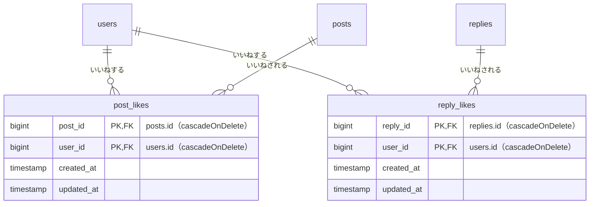

# いいね機能 設計書

Issue: [#9 ポストとリプライにいいねを付けられるようにする](https://github.com/TakanoriShima/post-app-practice/issues/9)

## 概要

ポストとリプライに「いいね」を付けたり、取り消したりできるようにする。ログインしている人が、ハートのボタンを押す。

- 1人が同じポスト（リプライ）に付けられるのは1回だけ。付けた人が取り消せるのは、自分のいいねだけ。
- 表示は、ハートのボタンと件数。**押していないときは灰色の枠のハート、自分が押したときはピンクの塗りつぶしのハート**にする。
- 表示場所は、タイムラインのポスト、ポスト詳細のポストとリプライ、プロフィールのポスト一覧とリプライ一覧の4か所。
- ログインしていれば誰でも押せる（Policy は要らない）。自分のポスト・リプライにも押せる。
- **押しても画面は遷移しない。** 押したボタンだけが、その場で更新される（URL もスクロール位置もそのまま）。JavaScript が使えないときは、押した画面に位置つきで戻る、普通のフォーム送信になる。
- 件数が0のときは、件数を出さず、ハートだけを出す。
- 通知、いいねした人の一覧は作らない。

## 受け入れ条件

- [ ] ログインしていれば、ポストにいいねを付けたり、取り消したりできる
- [ ] ログインしていれば、リプライにいいねを付けたり、取り消したりできる
- [ ] 同じ人が同じものに付けられるのは1回だけ（2回押しても1件のまま、エラーにならない）
- [ ] 自分のいいねだけを取り消せる（ほかの人のいいねは消えない）
- [ ] 件数と、自分が押したかが、4か所（タイムライン、ポスト詳細のポストとリプライ、プロフィールのポスト一覧とリプライ一覧）に正しく出る
- [ ] 押していないときは灰色の枠のハート、押したときはピンクの塗りつぶしのハートで出る
- [ ] ポストやリプライを消すと、そのいいねも消える
- [ ] 未ログインでは、いいねも取り消しもできない
- [ ] いいねボタンを押しても画面は遷移せず、押したボタン（ハートと件数）だけがその場で更新される
- [ ] 通信に失敗したときは、ボタンは元のままで、短いメッセージが出る

補足（決めた内容）

- 押しても画面は遷移しない。サーバーが**ボタンを描画した HTML の断片**を返し、JavaScript が今のボタンを置き換える（見た目、ラベル、件数の出し分けをサーバーの1か所で決めるため）。
- 応答を待ってから入れ替える（押している間は、ボタンを少し薄くして、もう一度押しても送らない）。
- 押した瞬間だけ、ハートが少し大きくなって戻る（動きが苦手な人向けの設定では動かさない）。
- JavaScript が使えないときは、押した画面に、押した位置つきで戻る（今までの動き）。
- 「いいね」と「取り消し」は別のルート（`POST` と `DELETE`）にする。二重クリックしても、付けて外す、とならず、結果が同じになる。
- ポスト・リプライは、一覧の取得時に件数と「自分が押したか」をまとめて取り、ポストやリプライごとにクエリが増えないようにする。

## 変えないもの

- タイムラインの並び、ポストとリプライの投稿・編集・削除、詳細ページ、プロフィール、認証。
- 既存のテーブル。ポストのリプライ件数 `(N)` の表示。
- ポスト・リプライの認可（`PostPolicy`、`ReplyPolicy`）。いいねは、ログインしていれば誰でも押せる。

対象外（今回は作らない）

- いいねの通知
- いいねした人の一覧、件数を押したときの一覧
- 「自分がいいねしたポスト」の一覧
- いいねの多い順の並べ替え
- ポストとリプライ以外へのいいね
- 押す前に見た目を先に変え、失敗したら戻す動き（応答を待ってから入れ替える）
- シーダーでのいいねの投入

## 増えるテーブル

テーブルを2つ足す。既存のテーブルは変えない。

| テーブル | カラム | 制約 |
| --- | --- | --- |
| `post_likes` | `post_id`、`user_id`、`created_at`、`updated_at` | 主キーは `(post_id, user_id)` の組み合わせ。両方とも外部キーで、`cascadeOnDelete` |
| `reply_likes` | `reply_id`、`user_id`、`created_at`、`updated_at` | 主キーは `(reply_id, user_id)` の組み合わせ。両方とも外部キーで、`cascadeOnDelete` |

- **組み合わせの主キー**で、同じ人が同じものに2回付けられない（アプリ側にミスがあっても、DB が防ぐ）。
- **後始末のコードは要らない**。ポストを消すと、ポストのいいねは外部キーで消え、リプライも外部キーで消えるので、リプライのいいねも消える。ユーザーが消えたときも同じ。
- **1つの `likes` テーブル（ポリモーフィック）にしなかった理由**: ポストを消したとき、リプライは DB の外部キーで消える。このとき Laravel の削除イベントが動かないので、リプライのいいねが残ってしまう。2テーブルなら、外部キーだけで確実にきれいになる。
- モデルは作らない。`Post` と `Reply` に `likedBy()`（ユーザーとの多対多）を定義し、`syncWithoutDetaching`（付ける）と `detach`（取り消す）で操作する。
- 共通の処理（件数と「自分が押したか」の取得）は、`App\Models\Concerns\HasLikes` に置く。

## 増える画面

新しい画面は増えない。既存の4か所にハートのボタンが増える。

### ルート

`auth` ミドルウェアグループ内に4つ足す。

| ルート | 名前 | 内容 |
| --- | --- | --- |
| `POST /posts/{post}/like` | `posts.like.store` | ポストにいいねする |
| `DELETE /posts/{post}/like` | `posts.like.destroy` | ポストのいいねを取り消す |
| `POST /replies/{reply}/like` | `replies.like.store` | リプライにいいねする |
| `DELETE /replies/{reply}/like` | `replies.like.destroy` | リプライのいいねを取り消す |

- 付けるときは、すでに付いていても、エラーにせず何もしない。取り消すときも、付いていなくても、エラーにしない。
- 存在しないポスト・リプライは 404。未ログインはログイン画面へ。
- 操作するのは、常にログイン中の本人のいいねだけ（`user_id` は画面から受け取らない）。

### 押したあとの動き（画面遷移しない）

1. ハートを押す → JavaScript が送信を止め（`preventDefault`）、裏で（`fetch`）同じルートに送る（`_token` と、取り消しのときの `_method=DELETE` を含むフォームの中身、`X-Requested-With: XMLHttpRequest` つき）。
2. サーバーは、いいねを付ける（取り消す）→ 最新の件数と「自分が押したか」を読み直す → `<x-like-button>` を描画した HTML の断片（1つの `<form>`）を 200 で返す。断片には、`<style>` と `<script>` を含めない。
3. JavaScript が、返ってきた断片で、今のフォームを置き換える。
4. キーボードのフォーカスがボタンにあったときは、新しいボタンにフォーカスを戻す（キーボードや読み上げの操作が途切れない）。
5. 「押していない → 押した」になったときだけ、ハートに動き（`like-pop`）を付ける。

- 件数は、押した瞬間のサーバーの最新の値になる。ほかの人が付けたいいねも反映される。
- 押している間は、フォームに `aria-busy="true"` を付け、ボタンを薄くして、もう一度押しても送らない（`disabled` にするとフォーカスが外れるので使わない）。
- サーバーは、`X-Requested-With`（`$request->ajax()`）があれば断片を返し、なければ、押した画面へのリダイレクトを返す。

**失敗したとき**

| 状況 | 動き |
| --- | --- |
| ログインが切れている（401、またはリダイレクトされた） | ログイン画面へ移動する（フォームの `data-login-url`） |
| セッションの期限切れ（419） | 画面を再読み込みする（トークンを取り直すため） |
| 通信の失敗、サーバーのエラー、想定外の応答 | ボタンは元の状態のまま、横に「通信に失敗しました」（`role="alert"`）を3秒だけ出す。もう一度押せる |

**JavaScript が使えないとき（フォールバック）**

- 普通のフォーム送信になり、押した画面に戻る（`back()`）。プロフィールの `?tab=replies` も、元のまま戻る。
- 戻り先に、押したものの位置（`#post-ID`、`#reply-ID`）を付けて、その位置までスクロールする。
- 戻り先が分からないときは、ポストはタイムライン、リプライはそのポストの詳細ページへ、位置つきで戻る。

### ハートのボタン（`<x-like-button>`）

- Blade コンポーネント `<x-like-button :model="$post" type="post" />`（リプライは `type="reply"`）。4か所で共通に使う。
- 押していないときは `POST`、押したときは `DELETE`（`@method`）のフォームを出す。**いいねするルートと取り消すルートは URL が同じで、メソッドだけが違う。**
- 状態は、色だけでなく形でも区別する。

| 状態 | ハート | 件数の文字 |
| --- | --- | --- |
| 押していない | 灰色（`#7A8590`）の枠だけ | 灰色（`#5B6570`） |
| 自分が押した | ピンク（`#F91880`）の塗りつぶし | 少し濃いピンク（`#C0146B`） |
| カーソルを乗せた | 枠がピンクになり、背景に薄いピンク（ピンクの10%の透明度）の丸 | 少し濃いピンク |

- ハートは、文字の `♥` ではなく、インラインの SVG（環境で絵文字にならず、色と塗りつぶしを CSS で切り替えられる）。18px で、押せる範囲は高さ32px。
- 件数は、1以上のときだけ出す（0件は出さない）。数字の幅はそろえる（`tabular-nums`）。
- `aria-pressed`（押したか）と、`aria-label`（「いいねする」「いいねを取り消す（3件）」）を付ける。キーボード操作では、オレンジの枠を出す（今のアプリと同じ）。
- スタイルと JavaScript は部品の中に置き、`@once` で、1ページに1回だけ出す。JavaScript は、ボタンごとではなく `document` で送信を受けて処理する（あとから置き換わったボタンにも効く）。
- 引数 `assets`（既定 `true`）で、スタイルと JavaScript を出すかを切り替える。サーバーが断片を返すときは `false`。
- 押した瞬間の動き（`like-pop`）は、1.0倍 → 1.3倍 → 1.0倍を0.25秒。`prefers-reduced-motion: reduce` のときは動かさない。
- 失敗のメッセージ（`.like-error`）は、赤（`#D6402C`）の小さな文字。

### 表示場所

| 画面 | 対象 | 位置 |
| --- | --- | --- |
| タイムライン | 各ポスト | 本文の下の行の、一番左（右に「編集」「削除」） |
| ポスト詳細 | ポスト本体と、各リプライ | ポスト・リプライの下の行の、一番左（リプライは右に「削除」） |
| プロフィール（ポスト） | 各ポスト | タイムラインと同じ |
| プロフィール（リプライ） | 各リプライ | リプライの本文の下 |

- ポストとリプライの要素に `id`（`post-12`、`reply-5`）を付ける（戻ってきたときの位置）。

### 取得のしかた

- ポスト・リプライの一覧の取得時に、`withLikeState($viewer)`（`HasLikes` のスコープ）で、件数（`likes_count`）と、見ている人が押したか（`liked_by_me`）を、まとめて取る。
- 対象は、`PostController` の `index` と `show`（ポストとリプライ）、`ProfileController` の `show`（ポスト一覧とリプライ一覧）。
- ポスト・リプライの数が増えても、クエリの数は変わらない。

## 入力チェックとメッセージ一覧

入力欄はなく、画面から送る値もない（ルートの `{post}`、`{reply}` と、ログイン中のユーザーだけで決まる）。入力チェックとメッセージは、増えない。

| 状況 | 結果 |
| --- | --- |
| 未ログインで、いいね・取り消しのルートにアクセス | ログイン画面へリダイレクト（`auth`） |
| 存在しないポスト・リプライを指定した | 404（ルートモデルバインディング） |
| すでにいいねしているものに、もう一度いいねした | エラーにせず、1件のまま |
| 未ログインで、裏から送った（`fetch`。既定の `Accept: */*`） | 401（ログイン画面へのリダイレクトではない）。JavaScript がログイン画面へ移動する |
| セッションの期限切れで、裏から送った | 419。JavaScript が再読み込みする |
| いいねしていないものを、取り消した | エラーにせず、何もしない |

## テスト観点

Feature テスト（`tests/Feature/LikeTest.php`）で確認する。

**いいねする・取り消す**（ポストとリプライの両方）

- いいねすると、1件増える。取り消すと、1件減る。
- 同じものに2回いいねしても、1件のままで、エラーにならない。テーブルの主キーでも、2回目は入らない。
- いいねしていないものを取り消しても、エラーにならない。
- ほかの人のいいねは、取り消せない（残る）。
- 自分のポスト・リプライにも、いいねできる。
- 未ログインでは、いいねも取り消しもできない。存在しないポスト・リプライは 404。
- ポストのいいねとリプライのいいねは、別々に数えられる。

**押した画面に戻る（JavaScript が使えないときのフォールバック）**

- 押した画面に、押したポスト（リプライ）の位置（`#post-ID`、`#reply-ID`）つきで戻る。取り消したときも同じ。
- プロフィールのリプライタブから押すと、タブを保ったまま戻る。
- 戻り先が分からないとき、ポストはタイムライン、リプライはポスト詳細へ、位置つきで戻る。

**画面遷移しない（裏からの送信）**（PHPUnit）

- 裏からの送信（`X-Requested-With` つき）で、いいねすると、リダイレクトせず 200 で断片を返す。取り消しも同じ。リプライも同じ。
- 断片が、押した状態（ピンク、`aria-pressed="true"`、`DELETE`、件数が最新）と、押していない状態（0件は件数なし）を正しく表す。
- 断片は、1つの `<form>` だけで、`<style>` と `<script>` を含まず、新しいトークンとログイン画面の行き先（`data-login-url`）を含む。
- 付いているものに付けても1件のまま。取り消せるのは自分のいいねだけ。
- 未ログインで裏から送ると 401（リダイレクトではない）。存在しないものは 404。
- 普通のフォーム送信は、今までどおりリダイレクトする。
- スクリプトとアニメーション、失敗メッセージの定義が、1ページに1回だけ出る（タイムライン、ポスト詳細、プロフィール）。
- 裏からの送信のクエリの数が、いいねの数に関わらず一定。

**画面での動き（JavaScript）**

PHPUnit では確かめられないので、jsdom（仮想ブラウザ）で、実際の JavaScript と、実際に描画したボタンの HTML を使って確認した（53項目。テストのコードはリポジトリには入れていない）。

- 送信を止める（画面遷移しない）。同じ URL に `POST` で、`X-Requested-With`、Cookie、フォームの中身を付けて送る。
- 応答の断片でフォームが置き換わり、押した状態（`liked`、`aria-pressed="true"`、件数）になり、ハートが動く。取り消しのときは動かさない。フォーカスがあったときだけ新しいボタンに戻し、別の要素のフォーカスは奪わない。
- 押している間の二重クリックは、1回しか送らない。
- 401 とリダイレクトはログイン画面へ、419 は再読み込み。
- 通信エラー、500、想定外の応答では、ボタンは元のまま、メッセージが出て、3秒後に消え、もう一度押せる。
- いいね以外のフォームには何もしない。別のポストのボタンには影響しない。

**ブラウザで実際に押して確認する項目**（見た目と動きなので、手で確認する）

- [ ] タイムラインで、灰色の枠のハートを押すと、画面が動かず、ピンクの塗りつぶしになり、件数が出る。ハートが一瞬大きくなる。
- [ ] もう一度押すと、灰色の枠に戻る。0件になると、件数が消える。
- [ ] スクロール位置が変わらない。ブラウザの「戻る」で、前のページに戻れる（履歴が増えていない）。
- [ ] ポスト詳細のポストとリプライ、プロフィールのポスト一覧とリプライ一覧でも、同じように動く。
- [ ] キーボード（Tab と Enter、Space）で押せて、押したあともフォーカスの枠がボタンに残る。
- [ ] 別のタブで自分がログアウトしたあとに押すと、ログイン画面へ移動する。
- [ ] 開発者ツールで通信を切って押すと、「通信に失敗しました」が出て、3秒後に消える。
- [ ] OS の「視覚効果を減らす」をオンにすると、ハートが動かない。
- [ ] スマホの幅で、ハートが押しやすく、行が崩れない。

**表示**

- 押していないときは、灰色の枠のハートで、`POST` のフォーム。押したときは、ピンクの塗りつぶしのハートで、`DELETE` のフォーム。
- 色と形の定義（灰色、ピンク、濃いピンクの件数、ホバー、キーボード操作の枠）が出る。スタイルは1ページに1回だけ。
- 件数は、1以上のときだけ出る。0件は出さない。自分以外のいいねも数える。
- 押したかどうかは、見ている人ごとに決まる。ポストごとに件数が別々に出る。
- 4か所（タイムライン、ポスト詳細のポストとリプライ、プロフィールのポスト一覧とリプライ一覧）に、ハートが出る。自分のリプライには、削除とハートの両方が出る。

**後始末**

- ポストを消すと、ポストのいいねと、リプライのいいねも消える。
- リプライを消すと、そのいいねが消え、ポストのいいねは残る。
- ほかのポストのいいねは、消えない。

**クエリの数**

- タイムライン、ポスト詳細、プロフィール（ポストとリプライ）で、ポスト・リプライが1件のときと10件のときで、クエリの数が変わらない。

**既存の動きが変わらないこと**

- 既存のテスト（`ReplyTest` ほか）が引き続き通る。タイムラインの並びとリプライ件数、ポストの編集・削除が変わらない。

## 環境の準備

- `./vendor/bin/sail artisan migrate` で、`post_likes` と `reply_likes` を作る。
