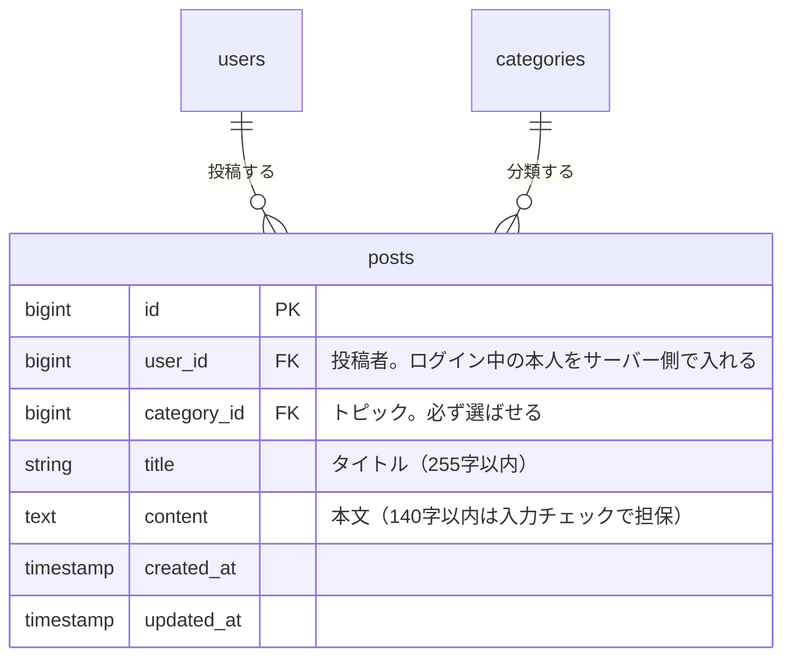

# 新規投稿機能 設計書

Issue: [#8 ポストの新規投稿機能を追加する](https://github.com/TakanoriShima/post-app-practice/issues/8)

## 概要

今のアプリでは、ポストを作る手段がない（作成の create / store が未実装）。ログインしている人が、タイトル、トピック、本文を入れて、新しいポストを投稿できるようにする。

- 入口は、タイムラインの上部固定ヘッダーの「新規投稿」ボタンと、トップページ（`/`）のログイン中の表示の「新規投稿」リンク。
- 作成画面（`GET /posts/create`）に、タイトル、トピック、本文のフォームを出す。
- 送信（`POST /posts`）に成功したら、タイムラインへ戻る。新しいポストが一番上に出る。
- 投稿者はログイン中の本人。`user_id` はサーバー側で決め、画面から送られた値は使わない。
- ログインしていれば誰でも投稿できるので、Policy は要らない。未ログインはログイン画面へ。
- 入力チェックとメッセージは、新規投稿と編集で共通にする。これにより、編集画面のエラーメッセージも日本語になる。
- フォームは、新規投稿と編集で共通の部品（`posts/_form.blade.php`）にする。
- トピックは「選択してください」を初期状態にして、必ず選ばせる。
- 送信したらボタンを無効にして、二重送信を防ぐ。

**ルートの書き順に注意**

- `GET /posts/create` は、`GET /posts/{post}`（`posts.show`）より前に書く。
- 後ろに書くと、`create` が `{post}` として扱われて 404 になる。この順序は、テストでも守る。

## 受け入れ条件

- [ ] ヘッダーの「新規投稿」から、作成画面を開ける
- [ ] タイトル、トピック、本文を入れて送ると、ポストが1件増え、タイムラインの一番上に出る
- [ ] 投稿者は、ログイン中の本人になる（送られた `user_id` は使わない）
- [ ] タイトル、トピック、本文のどれかが空のときは、日本語のエラーが表示され、ポストは増えない
- [ ] 本文が141字以上のときは、日本語のエラーが表示され、ポストは増えない
- [ ] 未ログインでは、作成画面も投稿もできない

補足（決めた内容）

- 入口は、ヘッダーの「新規投稿」ボタンと、トップページ（`/`）のログイン中の表示の「新規投稿」リンク。タイムライン上部の入力欄は作らない。
- 投稿後の遷移は、タイムライン（詳細ページではない）。
- 「投稿しました」の通知は出さない（このアプリには、いまフラッシュメッセージがない）。

## 変えないもの

- タイムラインの一覧、ポストの編集・削除、ポスト詳細、リプライ、プロフィール。
- ポストの認可（`PostPolicy`）。ヘッダーの「プロフィール」「ログアウト」の動き。
- DB。新しいテーブルも列も増えない（`posts` の既存の列だけを使う）。
- 編集画面の動き（今の値が入る、更新したらタイムラインへ戻る、本文の残り文字数が出る）。ただし、次の2点は変わる。
  - 入力エラーのメッセージが、日本語になる（以前は本文が140字超のときだけ日本語で、ほかは英語の標準メッセージだった）。
  - フォームに `required` を付けなくなる。空のまま送っても、ブラウザの吹き出しではなく、サーバー側のメッセージが出る（リプライやプロフィールの入力欄と同じ）。

対象外（今回は作らない）

- 下書き、画像の添付、公開範囲、タグ
- リッチテキスト
- 投稿後の「投稿しました」の通知
- タイムライン上部の入力欄
- 連投の制限（`throttle`）

## 増えるテーブル

新しいテーブルは増えない。`posts` テーブルの既存の列を使う。

| カラム | 入力元 | 内容 |
| --- | --- | --- |
| `user_id` | サーバー（`$request->user()`） | 画面からは送らない。送られても使わない |
| `category_id` | フォーム | 存在するトピックだけ |
| `title` | フォーム | 必須、255字以内 |
| `content` | フォーム | 必須、140字以内 |

- `user_id` は、`$request->user()->posts()->create($validated)` で決める。`$validated` には `title`、`content`、`category_id` の3つしか入らない。

## 増える画面

| 画面 | ルート | 名前 | 内容 |
| --- | --- | --- | --- |
| 新規投稿（新規） | `GET /posts/create` | `posts.create` | 作成フォーム |
| 投稿 | `POST /posts` | `posts.store` | 画面ではなく処理。成功したらタイムラインへ |

2つとも `auth` ミドルウェアグループ内に置く。`posts.create` は `posts.show` より前に定義する。

### 新規投稿（`posts.create`）

- ヘッダーはブランド名と、ページタイトル「新規投稿」。
- フォームは、タイトル（1行）、トピック（選択）、本文（複数行）。本文の下に、「残り N 字」を出す（編集画面と同じ。140字を超えたら赤字のマイナス）。
- トピックは、先頭に「選択してください」（値は空）があり、これが初期状態。エラーで戻ってきたときは、選んだトピックが残る。
- ボタンは「投稿する」と「キャンセル」（タイムラインへ戻る）。
- 送信したら、「投稿する」ボタンを無効にする。ブラウザの「戻る」で戻ってきたときは、有効に戻す。
- 入力エラーがあるときは、各項目の下にエラーメッセージを赤字で表示する。エラー時は入力した値を残す。

### フォームの共通化（`posts/_form.blade.php`）

- 新規投稿（`posts/create.blade.php`）と編集（`posts/edit.blade.php`）が、同じフォームを使う。
- 渡す値は、送信先（`$action`）、メソッド（`POST` か `PUT`）、編集のときだけ `$post`、トピック一覧、ボタンの文言、キャンセルの戻り先。
- 「選択してください」は、`$post` がないとき（新規）だけ出す。編集では出さない（今のポストのトピックが選ばれている）。
- 残り文字数の更新と、二重送信の対策の JavaScript も、フォームと一緒に置く。

### 入口の変更

- タイムラインのヘッダーの右側に、「新規投稿」ボタンを足す（「プロフィール」の左）。濃い色の丸いボタンにして、目立たせる。
- トップページ（`/`、`welcome.blade.php`）のログイン中の表示に、「タイムラインへ」の下へ「新規投稿」リンク（枠だけの丸いボタン）を足す。未ログインの表示（ログイン、アカウントを作成）には出さない。

## 入力チェックとメッセージ一覧

対象は、新規投稿（`posts.store`）と編集（`posts.update`）。両方で同じルールとメッセージを使う（`PostController::validatePost`）。

| 入力項目 | ルール | エラーになる条件 | メッセージ |
| --- | --- | --- | --- |
| `title` | `required` | 空、または空白だけ | タイトルを入力してください。 |
| `title` | `max:255` | 256字以上 | タイトルは255字以内で入力してください。 |
| `category_id` | `required` | 選ばれていない | トピックを選んでください。 |
| `category_id` | `exists:categories,id` | 存在しないトピック | トピックを選んでください。 |
| `content` | `required` | 空、または空白だけ | 本文を入力してください。 |
| `content` | `max:140` | 141字以上 | 本文は140字以内で入力してください。 |

- 本文の数え方は、これまでと同じ。ブラウザは改行を `\r\n`（2文字）で送るので、検証の前に `\n` に正規化してから数える。全角も1文字。
- 空白だけの入力は、Laravel の `TrimStrings` ミドルウェアで空になるので、`required` のエラーになる。
- このアプリには日本語の言語ファイルがなく、標準だと英語になるので、メッセージは日本語で明示する。

その他のエラー

| 状況 | 結果 |
| --- | --- |
| 未ログインで作成画面・投稿にアクセス | ログイン画面へリダイレクト（`auth`） |

## テスト観点

Feature テスト（`tests/Feature/PostCreateTest.php`）で確認する。既存のテストと同じく `RefreshDatabase` を使う。

**作成画面**

- 開ける。タイトル、トピック、本文の入力欄と、送信先（`posts.store`）が出る。
- `/posts/create` が `/posts/{post}` に食われず、404 にならない（ルートの書き順）。
- 未ログインだと、ログイン画面へリダイレクトされる。
- トピックは「選択してください」が初期状態で、トピックの一覧が出る。
- 残り文字数（140）と、二重送信の対策が出る。キャンセルはタイムラインへ戻る。

**投稿**

- 投稿するとポストが1件増え、投稿者は本人になる。
- 投稿したポストが、タイムラインの一番上に出る。
- `user_id` を送っても、投稿者は本人のまま。ほかのユーザーの名前では増えない。
- 投稿したポストは、本人が編集・削除できる。
- 未ログインでは投稿できない。

**入力チェック**

- タイトルが空、空白だけ、256字はエラーになり、増えない。255字ちょうどは投稿できる。
- トピックが空、存在しないトピックは、エラーになり、増えない。
- 本文が空、空白だけ、141字はエラーになり、増えない。メッセージは日本語。
- 本文が140字ちょうど、全角140字、改行を含む140字は投稿できる。
- エラーのとき、入力した値（タイトル、本文、選んだトピック、残り文字数）が残る。

**編集画面**

- タイトルが空、トピックが空、本文が空のときも、メッセージが日本語になる。
- 編集画面に、今の値が入り、「選択してください」は出ない。更新できる。

**入口と既存の動き**

- ヘッダーに「新規投稿」ボタンが出て、作成画面へ行ける。
- トップページ（`/`）は、ログイン中だけ「新規投稿」リンクが出る。未ログインでは出ない。
- 既存のテスト（`PostContentLimitTest` ほか）が引き続き通る。編集、削除、一覧、ポスト詳細、リプライ、プロフィールが変わらない。
