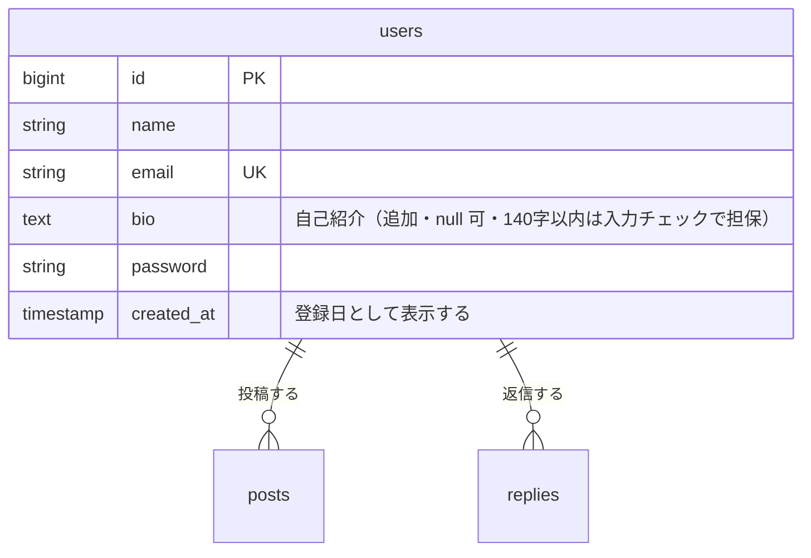

# プロフィール機能 設計書

Issue: [#2 プロフィール機能を追加する（表示・編集・ポストとリプライの一覧）](https://github.com/TakanoriShima/post-app-practice/issues/2)

アバター画像のアップロードは [#3](https://github.com/TakanoriShima/post-app-practice/issues/3) で扱う。この設計書の対象外。

## 概要

今のアプリでは、ポストの投稿者の名前しか見えず、その人がどんな人か、ほかに何を書いているかを知る手段がない。ログインしていれば誰でも他人のプロフィールを見られるようにし、その人のポストとリプライを一覧できるようにする。自分のプロフィールは編集できるようにする。

- プロフィールは、ログインしていれば誰のものでも見られる。未ログインはログイン画面へ。
- プロフィールには、アイコン（頭文字と色）、名前、自己紹介、登録日を出す。メールは、本人が自分のプロフィールを見るときだけ出す。
- プロフィールの下に「ポスト」「リプライ」の2タブを置き、その人のポスト一覧とリプライ一覧を出す。タブは `?tab=replies` で切り替える（JavaScript は使わない）。
- 編集できるのは本人だけ。編集のルートに `{user}` を持たせず、常にログイン中の本人を対象にするので、Policy は要らない。
- 入口は、ヘッダーの「名前（メール）」（自分のプロフィールへ）と、タイムラインとポスト詳細の投稿者（アイコンと名前。その人のプロフィールへ）。
- アイコンを Blade コンポーネント `<x-avatar>` に切り出す。今は `index.blade.php` と `show.blade.php` に色の配列の写しがあるので、1か所にまとめる。

## 受け入れ条件

- [ ] ログインしていれば、他人のプロフィールを見られる（名前、自己紹介、登録日）
- [ ] プロフィールに、その人のポスト一覧とリプライ一覧が出る（タブで切り替え）
- [ ] 自分のプロフィールで、名前・メール・自己紹介を編集できる
- [ ] 他人のプロフィールは編集できない
- [ ] 不正な入力ではエラーが表示され、保存されない
- [ ] 未ログインではプロフィールを見られない

補足（Issue で決めた内容）

- 一覧は新しい順で、全件表示（ページ分けはしない）。同時刻なら id の新しい順。
- ポスト一覧は、タイムラインと同じ見た目で、タイトルの横にリプライ件数 `(N)` も出す。
- リプライ一覧は、本文と、返信先ポストのタイトル（詳細ページへのリンク）を出す。
- 他人のプロフィールには、メールを出さない。

## 変えないもの

- タイムライン、ポスト、リプライの今の動き（一覧、編集、削除、送信）と認可（`PostPolicy`、`ReplyPolicy`）。
- ポストとリプライのバリデーションとメッセージ。
- 認証まわり（ログイン、登録、パスワードリセット）。
- 画像を設定していないユーザーのアイコンの見た目（頭文字と名前で決まる色）。部品にまとめるだけで、出力は変えない。
- タイムラインの変更は、ヘッダーの名前と、ポストの投稿者（アイコンと名前）をリンクにする点だけ。タイムラインのポスト1件の表示は、`posts/_post.blade.php` に切り出して、プロフィールのポスト一覧と共有する（出力は変えない）。

対象外（今回は作らない）

- アバター画像のアップロード（#3）
- パスワード変更
- 他人のプロフィールの編集
- 一覧のページ分け
- フォロー、ユーザー検索

## 増えるテーブル

新しいテーブルは増えない。`users` テーブルに列を1つ追加する。

| カラム | 型 | 制約 | 説明 |
| --- | --- | --- | --- |
| `bio` | text | null 可、`email` の後ろ | 自己紹介。未設定は null |

- 既存のユーザーの `bio` は null になる。既存データは変わらない。
- 図では、今回関係する列だけを載せている（`remember_token` などは省略）。

## 増える画面

| 画面 | ルート | 名前 | 内容 |
| --- | --- | --- | --- |
| プロフィール（新規） | `GET /users/{user}` | `users.show` | 自分も他人も同じ画面。上部にプロフィール、下にポスト／リプライのタブと一覧 |
| プロフィール編集（新規） | `GET /profile/edit` | `profile.edit` | 自分のプロフィールの編集フォーム |
| プロフィール更新 | `PUT /profile` | `profile.update` | 画面ではなく処理。成功したら自分のプロフィールへ戻る |

3つとも `auth` ミドルウェアグループ内に置く。

### プロフィール（`users.show`）

- 上部：アイコン（96px）、名前、自己紹介、「〇年〇月〇日に登録」。自己紹介が空のときは、自己紹介の行を出さない。
- 自分のプロフィールを見るときだけ、メールと「プロフィールを編集」ボタンを出す。他人のプロフィールには出さない。
- タブ：「ポスト（件数）」「リプライ（件数）」。表示中のタブを強調する。`?tab=replies` でリプライ、それ以外（指定なし、不正な値）はポスト。
- ポスト一覧：その人のポストを新しい順に、タイムラインと同じ見た目で出す。自分のポストには、タイムラインと同じく編集・削除が出る。ポストがないときは「まだポストがありません。」
- リプライ一覧：その人のリプライを新しい順に出す。各リプライは、アイコン、名前、日時、「『（返信先ポストのタイトル）』へのリプライ」（詳細ページへのリンク）、本文。リプライがないときは「まだリプライがありません。」
- 表示するタブの分だけ取得する（もう片方の一覧は取得しない）。

### プロフィール編集（`profile.edit`）

- 名前、メールアドレス、自己紹介の3項目のフォームに、今の値を入れて出す。自己紹介には、ポストの編集画面と同じ「残り〇字」を出す。
- 入力エラーがあるときは、各項目の下にエラーメッセージを赤字で表示する。エラー時は入力した値を残す。
- 「更新」で `profile.update` へ送る。「キャンセル」は自分のプロフィールへ戻る。
- 空のまま送ったときにサーバー側のエラーを見せるため、`required` は付けない（リプライの入力欄と同じ）。

### 送信のあとの遷移

- 更新に成功したら、自分のプロフィールへ戻る。
- 入力エラーのときは、編集画面に戻ってエラーを表示する。何も保存しない。

### 入口の変更

- ヘッダー（タイムライン）の「名前（メール）」を、自分のプロフィールへのリンクにする。
- タイムラインとポスト詳細の投稿者（アイコンと名前）、ポスト詳細でリプライした人（アイコンと名前）を、その人のプロフィールへのリンクにする。

### アイコンの部品（`<x-avatar>`）

- `<x-avatar :user="$user" :size="44" :link="true" />`。`size` は丸の直径（px）で、`link` を付けるとプロフィールへのリンクで包む。
- 色の配列は部品の中の1か所にまとめる。名前から決まる色（`crc32 % 18`）と頭文字は今のまま。

## 入力チェックとメッセージ一覧

対象はプロフィール更新（`profile.update`）。

| 入力項目 | ルール | エラーになる条件 | メッセージ |
| --- | --- | --- | --- |
| `name` | `required` | 空 | 名前を入力してください。 |
| `name` | `max:255` | 256字以上 | 名前は255字以内で入力してください。 |
| `email` | `required` | 空 | メールアドレスを入力してください。 |
| `email` | `email` | メールの形式でない | メールアドレスの形式で入力してください。 |
| `email` | `max:255` | 256字以上 | メールアドレスは255字以内で入力してください。 |
| `email` | `unique`（自分を除く） | 別のユーザーと重複 | このメールアドレスはすでに使われています。 |
| `bio` | `nullable`、`max:140` | 141字以上 | 自己紹介は140字以内で入力してください。 |

- `bio` の数え方は、ポストやリプライと同じにする。ブラウザは改行を `\r\n`（2文字）で送るので、検証の前に `\r\n` を `\n` に正規化する。全角も1文字と数える。
- `bio` が空のときは null で保存する（Laravel の `ConvertEmptyStringsToNull` による）。
- `email` の重複チェックは自分自身を除外する。除外しないと、メールを変えずに保存したときにエラーになる。
- このアプリには日本語の言語ファイルがなく標準だと英語になるので、メッセージは日本語で明示する。
- 更新できるのは `name`、`email`、`bio` だけ。それ以外の値（`id`、`user_id`、`password` など）が送られても無視する。

その他のエラー

| 状況 | 結果 |
| --- | --- |
| 未ログインでプロフィール、編集、更新にアクセス | ログイン画面へリダイレクト（`auth`） |
| 存在しないユーザーのプロフィール | 404（ルートモデルバインディング） |

## テスト観点

Feature テストで確認する。既存のテストと同じく `RefreshDatabase` を使う。

**プロフィールの閲覧**

- 他人のプロフィールが見える（名前、自己紹介、登録日）。
- 他人のプロフィールには、メールも「プロフィールを編集」も出ない。
- 自分のプロフィールには、メールと「プロフィールを編集」が出る。
- 自己紹介が空でも見られる。
- 未ログインだとログイン画面へリダイレクトされる。存在しないユーザーは 404。

**ポスト一覧・リプライ一覧**

- ポスト一覧には、そのユーザーのポストだけが出る。新しい順で、タイトルの横にリプライ件数が付く。
- ポストがないとき、リプライがないときは、その旨が出る。
- リプライ一覧には、そのユーザーのリプライだけが出る。返信先ポストのタイトルと詳細ページへのリンクが出る。新しい順に並ぶ。
- タブを切り替えると片方の一覧だけが出る。不正なタブ指定はポスト一覧になる。
- タブに件数が出る。

**入口とアイコン**

- ヘッダーの名前が、自分のプロフィールへのリンクになっている。
- タイムラインの投稿者、ポスト詳細の投稿者とリプライした人が、その人のプロフィールへのリンクになっている。
- アイコンが頭文字で出る。

**編集**

- 編集画面に現在の値が入っている。
- 名前、メール、自己紹介を更新できる。更新後のプロフィールに反映される。
- メールを変えずに保存してもエラーにならない。自己紹介を空にできる。
- 名前が空、メールが空、メールの形式が違う、ほかの人のメールと重複、自己紹介が141字、のいずれもエラーになり、保存されない。メッセージは日本語。
- 自己紹介が140字ちょうど、全角140字、改行を含む140字は保存できる。
- エラーのとき入力した値が残る。
- `id` や `user_id` を送っても、ほかのユーザーの情報は変わらない。
- 未ログインでは編集画面も更新もできない。

**既存の動きが変わらないこと**

- 既存のテスト（`ReplyTest`、`PostContentLimitTest` ほか）が引き続き通る。
- タイムラインの一覧、編集、削除、ポスト詳細、リプライの送信・削除が今までどおり動く。
