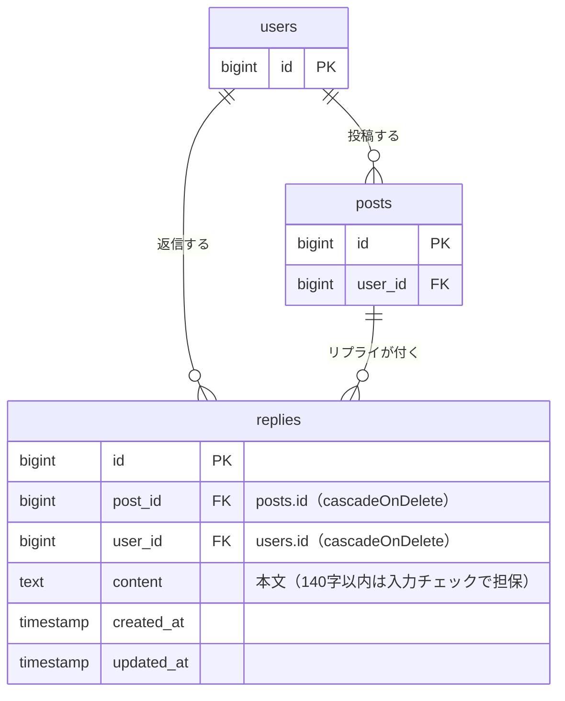

# リプライ機能 設計書

Issue: [#1 ポストにリプライ機能を追加する](https://github.com/TakanoriShima/post-app-practice/issues/1)

## 概要

今のアプリはポストを読むだけで、返す手段がない。ポストを読んだ人がその場で一言返せるように、ポストにリプライ（返信）を付ける機能を追加する。

- リプライはポスト直下の1階層のみ。リプライへのリプライ（入れ子）は扱わない。
- リプライの本文は140字以内（ポストと同じ）。
- ポストを1件開く詳細ページを新設し、ポスト本体・リプライ一覧・リプライ送信フォームを置く。
- 詳細ページへの入口は、タイムラインのポストのタイトルをリンクにする。タイトルの横にリプライ件数を `(2)` の形で表示する（0件は `(0)`）。
- リプライを消せるのは書いた本人のみ。判定は `PostPolicy`（`$user->id === $post->user_id`）と同じ考え方で、`ReplyPolicy` を用意する。
- すべての画面・操作はログイン必須（`auth` ミドルウェア）。

## 受け入れ条件

- [ ] ポストを1件開くと、そのポストとリプライの一覧が見える
- [ ] 本文を入れてリプライを送ると、一覧に増える
- [ ] 本文が空のままだと、エラーが表示されてリプライは増えない
- [ ] 自分のリプライは消せて、他人のリプライは消せない

補足（Issue で決めた内容）

- リプライは古い順に並べる。送信すると一覧の一番下に増える。
- 本文が141字以上のときも、エラーが表示されてリプライは増えない。

## 変えないもの

- タイムライン（`posts.index`）の今の動き。一覧の表示、ポストの編集、ポストの削除は変えない。変更はタイトルを詳細ページへのリンクにする点と、タイトルの横にリプライ件数を出す点だけ。
- ポストの認可（`PostPolicy`）。編集・削除できるのは、これまでどおり投稿者本人のみ。
- ポストのバリデーション（`title` / `content` / `category_id`）とそのメッセージ。
- ポストの作成（create / store）は引き続き対象外。
- ポスト削除の結果は変えない。ポストを消すとそのリプライも一緒に消える（外部キーの `cascadeOnDelete`）ので、リプライがあるポストも今までどおり消せる。

対象外（今回は作らない）

- リプライの編集
- リプライへのリプライ（入れ子）
- ポストの投稿者が他人のリプライを消す機能

## 増えるテーブル

`replies` テーブルを1つ追加する。既存のテーブルは変更しない。

| カラム | 型 | 制約 | 説明 |
| --- | --- | --- | --- |
| `id` | bigint | PK | |
| `post_id` | bigint | FK → `posts.id`、`cascadeOnDelete`、NOT NULL | リプライ先のポスト |
| `user_id` | bigint | FK → `users.id`、`cascadeOnDelete`、NOT NULL | リプライした人 |
| `content` | text | NOT NULL | 本文（`posts.content` と同じ型） |
| `created_at` / `updated_at` | timestamp | | 一覧の並び順（`created_at` の昇順）に使う |

- ポストが消えたらそのリプライも消える。ユーザーが消えたらそのユーザーのリプライも消える。
- `id` は自動採番なので、同じ時刻のリプライでも並びが決まるよう、並び順は `created_at` の昇順、同時刻なら `id` の昇順とする。

## 増える画面

| 画面 | ルート | 名前 | 内容 |
| --- | --- | --- | --- |
| ポスト詳細（新規） | `GET /posts/{post}` | `posts.show` | ポスト本体、リプライ一覧、リプライ送信フォーム |
| リプライ送信 | `POST /posts/{post}/replies` | `replies.store` | 画面ではなく処理。成功したら詳細ページへ戻る |
| リプライ削除 | `DELETE /replies/{reply}` | `replies.destroy` | 画面ではなく処理。削除したら詳細ページへ戻る |

3つとも `auth` ミドルウェアグループ内に置く。

### ポスト詳細（`posts.show`）

- 上部にポスト本体を表示する（投稿者、日時、カテゴリ、タイトル、本文）。見た目はタイムラインのポストに揃える。
- ポストの下にリプライ一覧を古い順に表示する。各リプライは投稿者、日時、本文を出す。
- リプライがないときは「まだリプライがありません。」と表示する。
- 自分のリプライにだけ「削除」ボタンを出す。表示の出し分けは `@can('delete', $reply)` で行う。
- 一覧の下にリプライ送信フォーム（本文の入力欄と送信ボタン）を置く。
- 入力エラーがあるときは、入力欄の下にエラーメッセージを赤字で表示する（`edit.blade.php` と同じ表示方法）。エラー時は入力した本文を残す。

### 送信・削除のあとの遷移

- 送信に成功したら、詳細ページに戻る。一覧の一番下にリプライが増えている。
- 入力エラーのときは、詳細ページに戻ってエラーを表示する。リプライは増えない。
- 削除したら、詳細ページに戻る。

### タイムライン（`posts.index`）の変更

- ポストのタイトルを `posts.show` へのリンクにする。
- タイトルの横（リンクの外）に、そのポストのリプライ件数を `(2)` の形で表示する。リプライがないポストは `(0)`。件数はリンクにしない。
- 件数は一覧取得時に `withCount('replies')` でまとめて数える（ポストごとに数えるクエリを増やさない）。
- これ以外の表示と動きは変えない。

## 入力チェックとメッセージ一覧

対象はリプライ送信（`replies.store`）の `content` のみ。

| 入力項目 | ルール | エラーになる条件 | メッセージ |
| --- | --- | --- | --- |
| `content` | `required` | 空、または空白だけ | 本文を入力してください。 |
| `content` | `string` | 文字列以外が送られた | （画面からは起きない。Laravel 標準のメッセージ） |
| `content` | `max:140` | 141字以上 | 本文は140字以内で入力してください。 |

- 文字数の数え方は、ポストの更新と同じにする。ブラウザは改行を `\r\n`（2文字）で送るので、検証の前に `\r\n` を `\n` に正規化する。全角も1文字と数える。
- `max` のメッセージは、ポストの `content.max` と同じ文言にする。
- 空白だけの入力は、Laravel の `TrimStrings` ミドルウェアで空になるので `required` のエラーになる。
- `required` のメッセージは、このアプリに日本語の言語ファイルがなく標準だと英語になるので、リプライ側で日本語を明示する。ポストの `required` の文言は今回は変えない。

その他のエラー

| 状況 | 結果 |
| --- | --- |
| 未ログインで詳細・送信・削除にアクセス | ログイン画面へリダイレクト（`auth`） |
| 他人のリプライを削除しようとした | 403（`$this->authorize('delete', $reply)`） |
| 存在しないポストやリプライを指定した | 404（ルートモデルバインディング） |

## テスト観点

Feature テストで確認する。`PostContentLimitTest` と同じく `RefreshDatabase` を使う。

**詳細ページ**

- ポストを開くと、そのポストの本文とリプライが見える。
- 別のポストのリプライは見えない。
- リプライは古い順に並ぶ。
- リプライがないときは「まだリプライがありません。」が出る。
- 未ログインだとログイン画面へリダイレクトされる。
- 存在しないポストは 404。

**リプライ送信**

- 本文を入れて送ると、`replies` に1件増え、詳細ページの一覧に出る（`user_id` と `post_id` が正しい）。
- 本文が空だと、エラーが表示され、リプライは増えない。
- 空白だけの本文でも、エラーになり増えない。
- 140字ちょうどは送れる。全角140字、改行を含む140字も送れる。
- 141字はエラーになり、増えない。メッセージは日本語。
- エラー時は入力した本文が残る。
- 未ログインでは送れない。

**リプライ削除**

- 自分のリプライは消せる。
- 他人のリプライを消そうとすると 403 になり、消えない。
- 自分のリプライにだけ「削除」ボタンが出て、他人のリプライには出ない。
- ポストの投稿者でも、他人のリプライは消せない（403）。
- 未ログインでは消せない。

**既存の動きが変わらないこと**

- 既存のテスト（`PostContentLimitTest` ほか）が引き続き通る。
- タイムラインの一覧、編集、削除が今までどおり動く。タイトルのリンク先が詳細ページになっている。
- タイトルの横にリプライ件数が出る（2件なら `(2)`、0件なら `(0)`）。
- 件数はポストごとに数えられ、別のポストのリプライは数に入らない。
- リプライが付いたポストを削除でき、そのリプライも一緒に消える。
